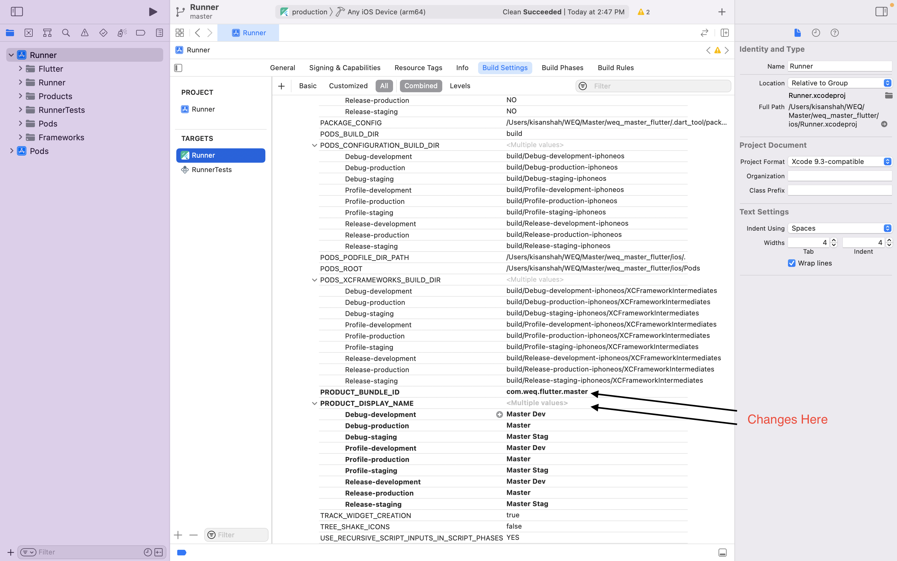

# Flutter Master

This repository serves as the master template and base for all upcoming projects within our organization. It provides a standardized structure, guidelines, and common components to ensure consistent development practices and streamline project setup.

## Table of Contents

- [Flutter Master](#flutter-master)
  - [Table of Contents](#table-of-contents)
    - [Git structure](#git-structure)
      - [Pre-Commit Hook for Commit Message Structure Validation](#pre-commit-hook-for-commit-message-structure-validation)
      - [Branch Structure](#branch-structure)
    - [Firebase](#firebase)
      - [Configuration](#configuration)
      - [Remote Config](#remote-config)
  - [Flavors](#flavors)
    - [Flavor Setup for Android](#flavor-setup-for-android)
    - [Change App \& Package](#change-app--package)
      - [Android](#android)
      - [iOS](#ios)

### Git structure

To maintain a consistent and organized version control history, please follow these suggested guidelines for your git commit:

- Aim for smaller, focused commits that represent logical units of work.
- Make atomic changes in each commit, addressing a specific task, bug fix, or feature.
- Test your code before committing to ensure it passes relevant tests.
- Structure commits in a logical progression that reflects the development process.
- Write descriptive commit messages that summarize the changes made.
- Utilize pull requests or code reviews for collaboration and peer review.
- Strike a balance between frequent, meaningful commits and avoiding excessive commit noise.

#### Pre-Commit Hook for Commit Message Structure Validation

To enforce a consistent commit message structure, you can set up a pre-commit hook in your Git repository.

To set up the pre-commit hook, follow these steps:

1. Create a new file named pre-commit (without any file extension) in the .git/hooks/ directory of your Git repository.

2. Add the following code to the pre-commit file:

   ```bash
   #!/bin/sh

   # Get the commit message from the file
   commit_message_file=$1
   commit_message=$(cat $commit_message_file)

   # Define the regex pattern for the commit message
   regex_pattern="^(feat|fix|docs|chore|test|style|refactor):\s.{1,50}(\n\n.{0,72}\n\n(.|\n)*(\n\n#[0-9]+)*)?$"

   # Check if the commit message matches the pattern
   if ! echo $commit_message | grep -Eq "$regex_pattern"; then
     echo "Invalid commit message structure. Please use the following format:"
     echo "<type>: <description>"
     echo ""
     echo "[optional body]"
     echo ""
     echo "[optional footer]"
     exit 1
   fi
   ```

3. If you are using Windows, open a command prompt and run the following command to grant read and execute permissions to the pre-commit file:
   `icacls .git/hooks/pre-commit /grant Users:RX`

   If you are using macOS or Linux, open a terminal and run the following command to make the pre-commit file executable:
   `chmod +x .git/hooks/pre-commit`

The pre-commit hook is now set up and active. Whenever you attempt to make a commit, the script will automatically check the commit message against the specified regex pattern.

#### Branch Structure


Reference ([Click Here](https://github.com/juntossomosmais/gitflow))

**In Gitflow, the repository has several main branches:**

`main`: This branch represents the production-ready code.

`develop`: This branch serves as the main development branch, containing the latest changes that are ready for integration.

`release`: This branch is created for release preparation, allowing final adjustments and bug fixes before deployment.

**The workflow involves the following steps:**

1. **Feature branches:** Developers create feature branches from the `develop` branch to work on specific features or enhancements.
2. **Development and testing:** Developers make changes, commit their work, and push the feature branch. Continuous integration and testing are performed on the feature branch.
3. **Merge to `develop`:** Once the feature is complete, it is merged back into the `develop` branch.
4. **Release branches:** When preparing for a new release, a release branch is created from the `develop` branch. This branch allows for final adjustments, bug fixes, and testing before deployment.
5. **Merge to `main`:** Once the release branch is thoroughly tested and ready, it is merged into the `main` branch for deployment to the production environment.

By following this Gitflow workflow, the project ensures a well-structured and controlled development process, enabling collaboration, seamless release management, and efficient bug fixes in both development and production environments.

### Firebase

Firebase is a mobile and web application development platform owned by Google. It provides a suite of cloud-based tools and services that help developers build, improve, and scale their apps more easily

As of now, we are using the following services of Firebase:

1. **Crashlytics**: Firebase Crashlytics provides real-time crash reporting for your app. It helps you track and analyze app crashes, generate detailed reports, and prioritize bug fixes.
2. **Firebase Cloud Messaging (FCM)**:FCM is a messaging platform that enables you to send notifications and messages to users on various platforms, including Android, iOS, and web.

3. **Firebase Remote Config**: Remote Config allows you to manage and customize your app's behavior and appearance remotely, without requiring a new app release.

#### Configuration

To get started with Firebase setup and integration into your Flutter app, follow these steps:

1. Download the Firebase CLI by visiting this link: [https://firebase.tools/bin/win/instant/latest](https://firebase.tools/bin/win/instant/latest) for Windows (replace "win" with "mac" or "linux" for other operating systems). This CLI tool will allow you to interact with Firebase from the command line.

2. Open the terminal or command prompt and execute the following commands:

   - `firebase login`: This command will prompt you to log in to Firebase using your Google account. Make sure to provide the necessary credentials.

   - `dart pub global activate flutterfire_cli`: This command will install the FlutterFire CLI, which is a tool specifically designed for integrating Firebase with Flutter.

3. If you haven't already done so, create a new project on the Firebase website. Skip this step if you have already created a project.

4. Execute the command `flutterfire configure` in the terminal. This command will guide you through configuring Firebase for your selected project. Select the project you created on the Firebase website and choose "Android" and "iOS" platforms by pressing the space button.

5. After adding any Firebase dependency to your `pubspec.yaml` file, run the command `flutterfire configure`. This command will ensure that Firebase is properly configured for the newly added dependencies.

6. In your `main.dart` file, add the following imports:

   ```dart
   import 'package:firebase_core/firebase_core.dart';
   import 'firebase_options.dart'; // Replace this with the appropriate file for your Firebase options
   ```

7. Inside the `void main()` function, add the following code to initialize Firebase:

   ```dart
   WidgetsFlutterBinding.ensureInitialized();
   await Firebase.initializeApp(
     options: DefaultFirebaseOptions.currentPlatform,
   );
   ```

8. Finally, run your app using the `flutter run` command in the terminal or by using your preferred IDE's run functionality.

By following these steps, you should be able to set up Firebase in your Flutter app and initialize it properly for use with Firebase services and features.

Since the configuration has already been taken care of, you can simply replace the files and your project will be ready to use Firebase. Here are the files that need to be replaced:

```bash
Project Folder
├── android
│   └── app
│       └── google-services.json        <-- Replace this file
├── ios
│   └── Runner
│       └── GoogleService-Info.plist    <-- Replace this file
├── lib
│   ├── ...
│   └── main.dart
├── ...
├── pubspec.yaml
└── ...
```

In your project, locate the respective folders based on the platform:

For Android:

- Navigate to the `android/app` directory.
- Replace the existing `google-services.json` file with the updated one.

For iOS:

- Navigate to the `ios/Runner` directory.
- Replace the existing `GoogleService-Info.plist` file with the updated one.

By following the folder structure and replacing the files in the correct locations, you will ensure that your base project has the updated Firebase configuration.

#### Remote Config

Firebase Remote Config provides a convenient way to dynamically update your app's settings and configurations, ensuring that your users have the best possible experience without requiring them to update their apps manually.

To enable remote configuration in your project, follow these steps:

1. Pull the `firebase_remote_config` branch.

2. Open the `main.dart` file in your project and add the following code:

   ```dart
   final container = ProviderContainer();
   final remoteConfig = container.read(remoteConfigProvider);
   await remoteConfig.init();
   ```

   This code initializes the remote config and sets it up for use in your project.

3. Now, you can use the remote config object in your code to retrieve values. For example:

   ```dart
   final config = ref.watch(remoteConfigProvider);
   ```

   This code retrieves the remote config object using the `remoteConfigProvider` and assigns it to the `config` variable.

4. To get a specific value from the remote config, you can use the `getString()` method. For example, to get the value for the key `RemoteConfigKeys.appContent`:

   ```dart
   Text(config.getString(RemoteConfigKeys.appContent)),
   ```

   This code retrieves the value associated with the key `RemoteConfigKeys.appContent` from the remote config object and displays it in a `Text` widget.

   By following these steps, you can enable remote configuration in your project and use the remote config object to retrieve values based on the keys you define. Make sure to replace `RemoteConfigKeys.appContent` with the actual key you want to use in your application.

## Flavors

Flavors refer to the ability to set up different environments or build configurations for your app using the same code base. Flavors allow developers to define separate configurations for various purposes, such as development, staging, and production. This enables customization of parameters, resources, and behavior specific to each flavor, allowing the creation of multiple app variants from a single codebase.

### Flavor Setup for Android

[Ref Video](https://www.youtube.com/watch?v=Vhm1Cv2uPko&ab_channel=MarcusNg)

```dart
├── app
│ ├── build.gradle  <--- Changes
│ └── src
│     └── main
│         └── AndroidManifest.xml  <--- Changes
│ ├── debug
│ ├── main
│ └── profile
├── build.gradle
├── gradle
│ └── wrapper
│ ├── gradle-wrapper.jar
│ └── gradle-wrapper.properties
├── gradle.properties
├── gradlew
├── gradlew.bat
├── local.properties
└── settings.gradle
```

android/app/build.gradle

```gradle
flavorDimensions "default"
productFlavors {
    development {
        dimension "default"
        resValue "string", "app_name", "Master Dev"
        applicationIdSuffix ".dev"
    }
    staging {
        dimension "default"
        resValue "string", "app_name", "Master Staging"
        applicationIdSuffix ".stag"
    }
    production {
        dimension "default"
        resValue "string", "app_name", "Master"
    }
}
```

android/app/src/main/AndroidManifest.xml

```xml
<manifest xmlns:android="http://schemas.android.com/apk/res/android">
    <application
        ##Add Below Line
        android:label="@string/app_name">
    </application>
</manifest>
```

### Change App & Package

#### Android

```gradle
flavorDimensions "default"
productFlavors {
   development {
      dimension "default"
      resValue "string", "app_name", "Master Dev" <-- Change Here
      applicationIdSuffix ".dev"
   }
   staging {
      dimension "default"
      resValue "string", "app_name", "Master Staging" <-- Change Here
      applicationIdSuffix ".stag"
   }
   production {
      dimension "default"
      resValue "string", "app_name", "Master" <-- Change Here
   }
}
```

#### iOS


